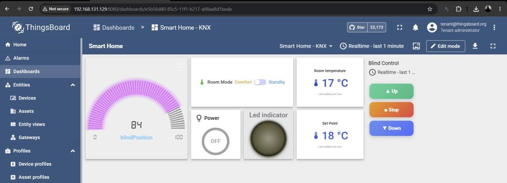
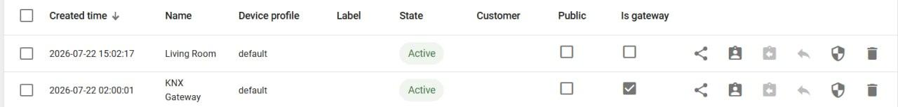
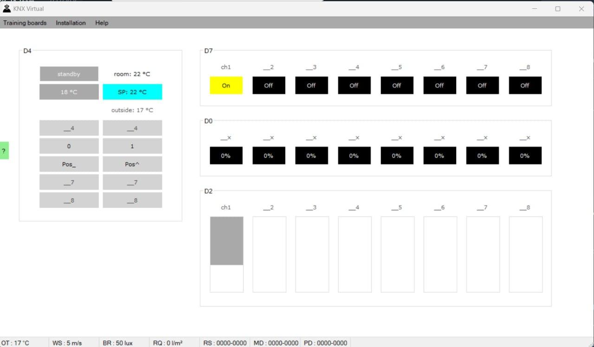
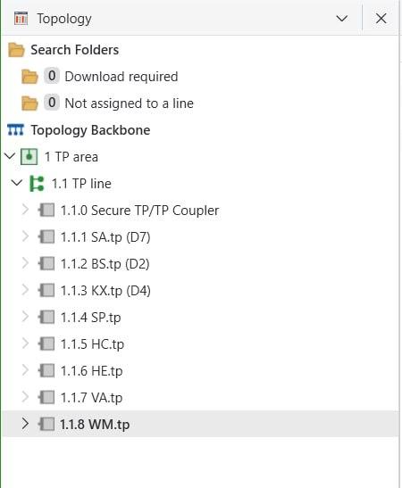
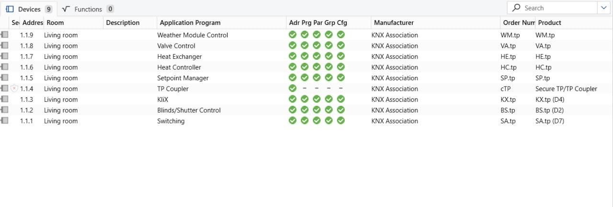
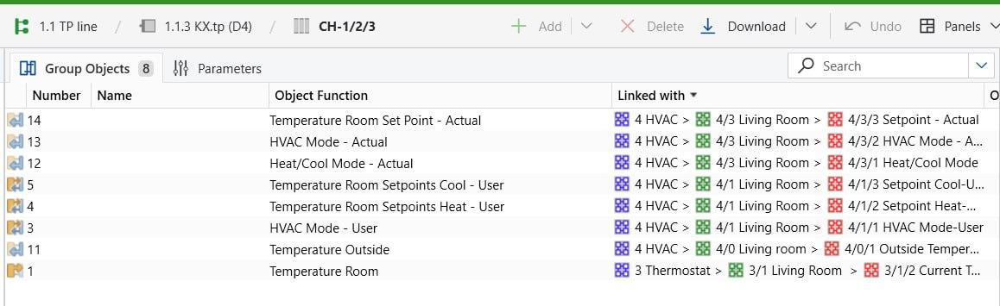
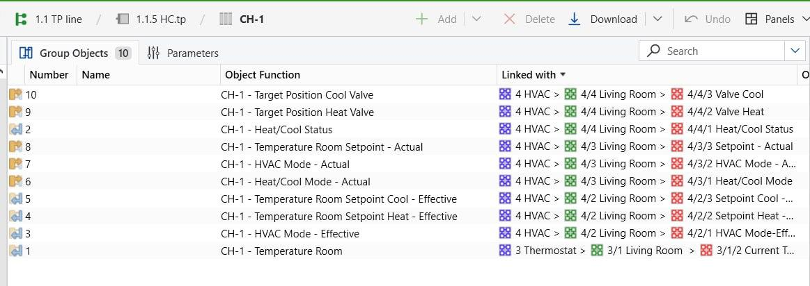
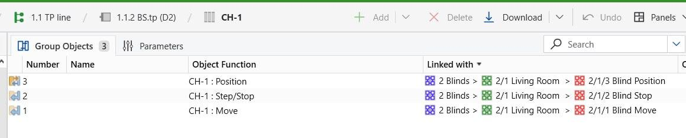
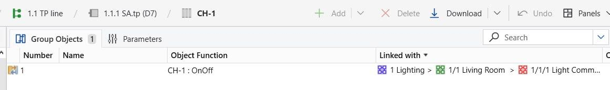

# خانهٔ هوشمند مبتنی بر KNX و ThingsBoard IoT Gateway

> شبیه‌سازی خانهٔ هوشمند KNX با نرم‌افزار **KNX Virtual**، اتصال آن به پلتفرم **ThingsBoard** از طریق **کانکتور KNX** در **ThingsBoard IoT Gateway** و کنترل و مانیتورینگِ دوطرفهٔ لحظه‌ای از طریق **داشبورد وب** و **اپلیکیشن موبایل**.

[](LICENSE)


🇬🇧 نسخهٔ انگلیسی این مستند: [README.md](README.md)

پروژهٔ پایانی درس **مبانی اینترنت اشیاء** — دانشگاه شهید بهشتی، نیم‌سال دوم ۱۴۰۴–۱۴۰۵. استاد درس: **دکتر عطارزاده**.

---

## فهرست

بخش‌های این مستند به‌ترتیب زیر هستند:

۱. [مقدمه](#مقدمه)
۲. [معماری](#معماری)
۳. [قابلیت‌ها](#قابلیتها)
۴. [دستگاه‌ها و توپولوژی KNX](#دستگاهها-و-توپولوژی-knx)
۵. [نگاشت آدرس‌های گروهی](#نگاشت-آدرسهای-گروهی)
۶. [زنجیرهٔ HVAC و ستپوینت](#زنجیرهٔ-hvac-و-ستپوینت)
۷. [محیط و شبکه](#محیط-و-شبکه)
۸. [راه‌اندازی](#راهاندازی)
۹. [داشبورد و ویجت‌ها](#داشبورد-و-ویجتها)
۱۰. [دسترسی از موبایل](#دسترسی-از-موبایل)
۱۱. [چالش‌ها و راه‌حل‌ها](#چالشها-و-راهحلها)
۱۲. [عیب‌یابی سریع](#عیبیابی-سریع)
۱۳. [تصاویر](#تصاویر)
۱۴. [ساختار مخزن](#ساختار-مخزن)
۱۵. [نکتهٔ امنیتی](#نکتهٔ-امنیتی)
۱۶. [سازنده](#سازنده)
۱۷. [مجوز](#مجوز)

---

## مقدمه

هدفِ این پروژه ساختِ یک حلقهٔ کامل اینترنت اشیاء برای خانهٔ هوشمند است:

- خواندن (از KNX به ThingsBoard): دمای اتاق، موقعیت کرکره، وضعیت چراغ و شیر، و ستپوینتِ مؤثر.
- نوشتن (از ThingsBoard به KNX): روشن/خاموش چراغ، حرکت کرکره (بالا/پایین/توقف)، تغییر مود HVAC (Comfort/Standby) و تنظیم ستپوینت دما.

باسِ شبیه‌سازی‌شدهٔ KNX از طریق ThingsBoard IoT Gateway و کتابخانهٔ `xknx` به ThingsBoard CE وصل می‌شود و کل سیستم از وب و موبایل کنترل می‌گردد.

## معماری

زنجیرهٔ کاملِ اتصال به‌صورت زیر است:

```text
KNX Virtual
   ⇅  KNXnet/IP Tunneling (UDP 3671)
ThingsBoard IoT Gateway  (KNX Connector / xknx)
   ⇅  MQTT (1883)
ThingsBoard CE (Docker)
   ⇅  HTTP (8080)
Web dashboard  +  ThingsBoard mobile app
```

توضیحِ اجزا:

- نرم‌افزار **KNX Virtual** روی هاستِ ویندوز اجرا می‌شود و باسِ KNX را با دستگاه‌های مجازی (چراغ، کرکره، کنترلر گرمایش و ...) شبیه‌سازی می‌کند؛ فقط یک تونل KNXnet/IP روی UDP دارد.
- سرویسِ **ThingsBoard IoT Gateway** داخل Docker روی یک ماشین مجازی اوبونتو (VMware) اجرا می‌شود و با `xknx` داده‌ها را می‌خواند (uplink) و فرمان‌ها را می‌نویسد (downlink).
- پلتفرمِ **ThingsBoard CE** روی همان ماشین مجازی و در Docker اجرا می‌شود و دستگاهِ `Living Room`، داشبورد و Rule Engine را نگه می‌دارد.
- کاربر از مرورگرِ وب و از اپلیکیشن موبایلِ ThingsBoard کنترل و مانیتور می‌کند.

## قابلیت‌ها

قابلیت‌های پیاده‌سازی‌شده عبارت‌اند از:

- 💡 روشن/خاموش کردن چراغ (سوییچ)
- 🪟 بالا/توقف/پایین بردن کرکره و نمایش لحظه‌ای موقعیت (٪)
- 🌡️ نمایش لحظه‌ای دمای اتاق و دمای بیرون
- 🎛️ نوشتن ستپوینت ترموستات و دریافت فیدبکِ ستپوینتِ مؤثر/واقعی
- ❄️🔥 تغییر مود HVAC (Comfort / Standby)
- 📱 کنترل دوطرفه و لحظه‌ای از وب و موبایل
- 🧩 ویجت سفارشیِ سه‌دکمه‌ای برای کرکره
- 🔧 کانکتور پچ‌شده برای پشتیبانی از DPT 275.100 (ستپوینت چهارمود) و DPT 20.102 (مود HVAC)

## دستگاه‌ها و توپولوژی KNX

نوعِ پروژه در KNX Virtual از نوع **Basic Functions – single room** است.

| آدرس فیزیکی | دستگاه | نقش |
|---|---|---|
| 1.1.1 | D7 — Switch Actuator (SA) | چراغ (روشن/خاموش) |
| 1.1.2 | D2 — Blinds (BS) | کرکره |
| 1.1.3 | D4 — KliX (HMI) | ترموستات / نمایش دما |
| 1.1.4 | D15 — Setpoint Manager (RTSM) | محاسبهٔ ستپوینت مؤثر |
| 1.1.5 | D16 — Heat Controller (HC) | ستپوینت واقعی + فرمان شیر |
| 1.1.6 | D17 — Heat Exchanger (HE) | شبیه‌سازی گرمایش/سرمایش |
| — | D6 — Valve Actuator (VA) | شیر گرمایش |
| 1.1.8 | WM — Weather Module | دمای بیرون |
| 1.0.255 | Tunnel | آدرس فردیِ گیت‌وی |
| 1.1.255 | KNX Virtual IF | آدرس فردیِ اینترفیس |

## نگاشت آدرس‌های گروهی

ساختارِ آدرس‌دهی: `1=Lighting, 2=Blinds, 3=Temperature, 4=HVAC`.

| دستگاه | Object | آدرس گروهی | DPT | جهت |
|---|---|---|---|---|
| 1.1.1 SA | Light Switch | `1/1/1` | 1.001 | نوشتن |
| 1.1.2 BS | Blind Move | `2/1/1` | 1.008 | نوشتن |
| 1.1.2 BS | Blind Step/Stop | `2/1/2` | 1.007 | نوشتن |
| 1.1.2 BS | Blind Position | `2/1/3` | 5.001 ٪ | خواندن |
| 1.1.3 KX | Current Temp (room) | `3/1/2` | 9.001 °C | خواندن |
| 1.1.3 KX | HVAC Mode-User | `4/1/1` | 20.102 | نوشتن |
| 1.1.3 KX | Setpoint Cool-User | `4/1/3` | 275.100 | ارسال از HMI |
| 1.1.4 SP | Setpoint Heat-User | `4/1/2` | 275.100 | نوشتن |
| 1.1.4 SP | Setpoint Heat-Effective | `4/2/2` | 9.001 °C | خروجی SP |
| 1.1.5 HC | Setpoint-Actual | `4/3/3` | 9.001 °C | خواندن/فیدبک |
| 1.1.5 HC | Valve Heat | `4/4/2` | 5.001 ٪ | نوشتن |
| 1.1.5 HC | Valve Cool | `4/4/3` | 5.001 ٪ | — |
| 1.1.8 WM | Outside Temperature | `4/0/1` | 9.001 °C | خواندن |

## زنجیرهٔ HVAC و ستپوینت

منطقِ کنترل دما به‌صورت زیر است:

```text
KliX (HMI/D4) --User setpoint--> Setpoint Manager (SP/D15) --Effective--> Heat Controller (HC/D16) --Valve--> Valve Actuator
     ^                                                                                                       |
     └------------------------------- Actual setpoint (feedback) <-----------------------------------------┘
```

درسِ کلیدی: نوشتن روی `4/2/2` (Effective) بی‌اثر است، چون Setpoint Manager دوباره رویش می‌نویسد؛ باید روی **ستپوینتِ کاربر** (`4/1/2`, DPT 275.100) نوشت، دقیقاً همان کاری که KliX/HMI انجام می‌دهد. برای همین کانکتور برای این DPT پچ شد (فایل [`config/patches/knx_connector_dpt.py`](config/patches/knx_connector_dpt.py)).

## محیط و شبکه

مشخصاتِ محیطِ اجرا در جدول زیر آمده است:

| مورد | مقدار |
|---|---|
| سیستم‌عاملِ میزبان | Windows |
| ماشین مجازی | Ubuntu 24.04 روی VMware |
| آی‌پیِ میزبان روی VMnet8 (NAT) | `192.168.131.1` |
| آی‌پیِ ماشین مجازی (NAT) | `192.168.131.129` (متغیر — با `ip -4 addr` چک شود) |
| نرم‌افزار KNX Virtual | روی ویندوز، فقط UDP روی `0.0.0.0:3671` |
| گیت‌وی و پلتفرم | داخل Docker روی همان ماشین مجازی |
| وبِ ThingsBoard | `http://<VM-IP>:8080` |

> نکتهٔ مهمِ شبکه: چون هم ماشین مجازی و هم میزبان روی سابنتِ `192.168.131.0/24` (NAT) هستند، کانکتور باید به آی‌پیِ VMnet8 ویندوز یعنی `192.168.131.1` وصل شود. آی‌پیِ خودِ ماشین مجازی با هر ری‌استارت ممکن است عوض شود.

فایلِ اینترفیس در ویندوز اینجاست: `C:\ProgramData\KNX\KV\v26\interface.txt` (یک خط با محتوای `192.168.131.1:3671`). پس از تغییر، KNX Virtual را کاملاً ببند و دوباره باز کن.

## راه‌اندازی

### گام ۱ — سمتِ KNX (ویندوز)

مراحلِ این گام:

۱. نرم‌افزارهای **KNX Virtual** و **ETS** را نصب کن.
۲. پروژهٔ ETS را از مسیرِ [`hardware/IOT_Finale.knxproj`](hardware/IOT_Finale.knxproj) باز کن.
۳. مطمئن شو KNX Virtual روی UDP `3671` گوش می‌دهد و اینترفیس به آی‌پیِ VMnet8 میزبان اشاره می‌کند.

### گام ۲ — ThingsBoard و گیت‌وی (Docker روی ماشین مجازی)

کانتینرهای اصلی:

| کانتینر | توضیح | پورت‌ها |
|---|---|---|
| `thingsboard-setup-mytb-1` | ThingsBoard CE + Postgres داخلی | 8080 (وب)، 1883 (MQTT) |
| `tb-gateway` (v3.7.8) | گیت‌وی با `network_mode: host` | — |

بخشِ کلیدیِ `docker-compose.yml` گیت‌وی:

```yaml
environment:
  - host=127.0.0.1          # گیت‌وی و بروکر روی یک ماشین‌اند
  - port=1883
  - accessToken=YOUR_DEVICE_ACCESS_TOKEN   # توکنِ واقعی را کامیت نکن
network_mode: host
```

دستورهای پرکاربرد:

```bash
cd ~/tb-gateway
docker compose up -d          # بعد از تغییر env
docker compose restart        # ری‌استارتِ سریع
docker compose logs -f --tail=50
```

> هشدار: هرگز `docker compose down` نزن — پین‌های `xknx` و پچ‌های فایل ریست می‌شوند. فقط از `stop/start/restart` استفاده کن.

### گام ۳ — کانکتور KNX

مسیرِ کانفیگ در رابط کاربری: `Gateways → KNX Gateway → Connectors → KNX → Configuration`.

کانفیگِ هدف در فایلِ [`config/knx.json`](config/knx.json) قرار دارد و سه بخشِ نگاشت دارد:

- بخشِ `timeseries` = خواندن از KNX (مانیتورینگ؛ نیازمندِ فلگِ `R`).
- بخشِ `attributeUpdates` = نوشتن روی KNX هنگام تغییر shared attribute (نیازمندِ فلگِ `W`).
- بخشِ `serverSideRpc` = خواندن/نوشتن با RPC (متدهای `setState` و `setSetpoint`).

اعمالِ پچِ کدِ کانکتور:

```bash
docker cp tb-gateway:/thingsboard_gateway/connectors/knx/knx_connector.py ~/knx_connector.py.bak
docker cp ~/knx_connector.py tb-gateway:/thingsboard_gateway/connectors/knx/knx_connector.py
docker restart tb-gateway
```

## داشبورد و ویجت‌ها

داشبوردِ **Smart Home** شاملِ این کنترل‌هاست:

| قابلیت | ویجت | مکانیزم |
|---|---|---|
| چراغ (روشن/خاموش) | Power button | Set attribute `light` یا RPC `setState` |
| مود HVAC (Comfort/Standby) | Single Switch | RPC `set` با `groupAddress=4/1/1; dataType=hvac_mode; value=2` (Standby) / `value=1` (Comfort) |
| کرکره (بالا/توقف/پایین) | ویجت سفارشیِ سه‌دکمه‌ای | Set shared attribute: `blindMove=false` (Up)، `blindStop=true` (Stop)، `blindMove=true` (Down) |
| درصدِ کرکره | Value card | نمایشِ `blindPosition` (٪) |
| ستپوینت / ترموستات | Gauge + ورودی | `targetSetpoint` (نوشتن) + `setpointDisplay` + `roomTemp` (خواندن) |

> نکتهٔ ساختِ ویجتِ سه‌دکمهٔ کرکره: این کنترل باید به‌صورتِ یک **نوع ویجت سفارشی (custom widget type)** ساخته و از مسیرِ `Widgets Library → Import` وارد شود، نه از Import داشبورد. این ویجت با `attributeService.saveEntityAttributes(...)` روی `SHARED_SCOPE` کار می‌کند.

## دسترسی از موبایل

چالشِ اصلی این است که سرورِ ThingsBoard روی ماشین مجازیِ NAT‌شده (`192.168.131.129:8080`) قرار دارد و گوشی روی Wi-Fi/LAN ویندوز است؛ پس یک **نگاشتِ پورت** روی هاستِ ویندوز این دو را به هم وصل می‌کند:

```bat
netsh interface portproxy add v4tov4 listenport=8080 listenaddress=0.0.0.0 connectport=8080 connectaddress=192.168.131.129
netsh advfirewall firewall add rule name="Allow ThingsBoard 8080" dir=in action=allow protocol=TCP localport=8080
```

سپس از گوشی (روی همان Wi-Fi) به آدرسِ `http://<windows-lan-ip>:8080` وصل شو. اگر آی‌پیِ ماشین مجازی بعد از ری‌استارت عوض شد، مقدارِ `connectaddress` را به‌روزرسانی کن. برای پاک‌کردنِ نگاشت:

```bat
netsh interface portproxy delete v4tov4 listenport=8080 listenaddress=0.0.0.0
```

## چالش‌ها و راه‌حل‌ها

مهم‌ترین چالش‌ها و راه‌حل‌ها:

- هاردکد بودنِ آی‌پیِ ماشین مجازی: آی‌پیِ قدیمی در دو جا هاردکد شده بود؛ نشانه‌ها خطای `[Errno 99] Cannot assign requested address` و وصل‌نشدنِ گیت‌وی بود. راه‌حل: قرار دادنِ `localIp` روی آی‌پیِ فعلی و `host=127.0.0.1` در compose.
- گم‌شدنِ تلگرام‌های نوشتن: تابعِ `xknx.tools.group_value_write` سنکرون و fire-and-forget است (بدون retry). هنگام قطعیِ لحظه‌ایِ تونل، نوشتن‌ها گم می‌شدند ولی خواندن‌ها (awaited + retry) سالم می‌ماندند.
- هدفِ اشتباهِ ستپوینت: نوشتن روی ستپوینتِ Effective (`4/2/2`) بی‌اثر است؛ باید روی ستپوینتِ کاربر (`4/1/2`, DPT 275.100) نوشت. این مورد با پچِ کانکتور حل شد.
- محدودیتِ تک‌تونل (ریشهٔ اصلی): نرم‌افزار KNX Virtual فقط یک تونل KNXnet/IP دارد. اگر هم‌زمان ETS Group Monitor و گیت‌وی آن را بخواهند، بر سرِ تونل دعوا می‌شود (چرخهٔ connect/lost هر ~۳۰ ثانیه) و هر ری‌کانکت، KNX Virtual را به مقدارِ پیش‌فرض (`comfort=22`) ریست می‌کند. راه‌حل: ETS را Disconnect نگه‌دار و فقط گیت‌وی روی تونل باشد.
- باگِ کانورترِ آپلینک: خطای `knx_uplink_converter.py ... 'NoneType' object is not subscriptable`. پچِ پیشنهادی: `if hasattr(converted_value, 'value'): converted_value = converted_value.value`.

## عیب‌یابی سریع

جدولِ عیب‌یابی:

| نشانه | علت | راه‌حل |
|---|---|---|
| `[Errno 99] Cannot assign requested address` | اشارهٔ `localIp` به آی‌پیِ ناموجودِ ماشین مجازی | مقداردهیِ `localIp` روی آی‌پیِ فعلی از `ip -4 addr` |
| هر تغییرِ UI بی‌اثر، همان خطا تکرار می‌شود | مقدارِ `host` غلط | قرار دادنِ `host=127.0.0.1` در compose و سپس بازسازی |
| `No usable KNX/IP device found` | آی‌پیِ discovery/gateway غلط | تنظیمِ `type: TUNNELING` با `gatewayIp: 192.168.131.1` |
| `Living Room = Inactive` | هیچ خواندنِ موفقی رخ نداده | داشتنِ حداقل یک `timeseries` خواندنی |
| ستپوینت/مود نمی‌ماند | اشتراکِ تونل بین ETS و گیت‌وی | Disconnect کردنِ ETS و تک‌تونل نگه‌داشتنِ گیت‌وی |
| خطای `database error` هنگام ورود | بالا نیامدنِ Postgres | صبر یا `docker restart thingsboard-setup-mytb-1` |
| نرسیدنِ گوشی به سرور | نبودِ نگاشتِ پورت روی NAT | اجرای `netsh portproxy` و بازکردنِ پورت در فایروال |

## تصاویر

### داشبوردِ Smart Home در ThingsBoard


### فهرستِ دستگاه‌ها در ThingsBoard


### پنلِ دستگاه در KNX Virtual


### توپولوژی در ETS


### فهرستِ دستگاه‌ها در ETS


### آبجکت‌های گروهی (KliX / HMI)


### آبجکت‌های گروهی (Heat Controller)


### آبجکت‌های گروهی (کرکره)


### آبجکت گروهی (Switch Actuator)


## ساختار مخزن

ساختارِ پوشه‌ها و فایل‌ها:

```text
.
├─ README.md                     # مستند انگلیسی
├─ README.fa.md                  # مستند فارسی (همین فایل)
├─ LICENSE                       # مجوز MIT
├─ .gitignore
├─ config/
│  ├─ knx.json                   # پیکربندی کانکتور KNX (توکن حذف شده)
│  └─ patches/
│     └─ knx_connector_dpt.py    # پچ کانکتور برای DPT 275.100 / 20.102
├─ hardware/
│  └─ IOT_Finale.knxproj         # فایل پروژهٔ ETS
└─ docs/
   ├─ IOT_final_Report.pdf       # گزارش کامل پروژه (فارسی)
   ├─ Project_Brief.pdf          # صورت پروژهٔ درس (فارسی)
   └─ images/                    # تصاویر استفاده‌شده در مستندات
```

## نکتهٔ امنیتی

توکنِ واقعیِ دستگاه در ThingsBoard و نام‌کاربری/رمزِ پیش‌فرضِ `tenant@thingsboard.org` که در گزارش آمده‌اند، به‌عمد در این مخزن منتشر **نشده‌اند**. مقادیرِ `YOUR_DEVICE_ACCESS_TOKEN` و `REPLACE-WITH-YOUR-CONNECTOR-ID` در فایلِ [`config/knx.json`](config/knx.json) و در فایلِ compose را با مقادیرِ خودت جایگزین کن و اسرار را از مخزن دور نگه‌دار (طبق `.gitignore`).

## سازنده

محسن نوروزی (Mohsen Norouzi)

- گیت‌هاب: [@mohsen-norouzi237](https://github.com/mohsen-norouzi237)
- ایمیل: [mnorouzi2018@gmail.com](mailto:mnorouzi2018@gmail.com)
- لینکدین: [mohsen-norouzi](https://www.linkedin.com/in/mohsen-norouzi-143bb5336/)

## مجوز

این پروژه تحت مجوز [MIT](LICENSE) منتشر شده است.

---

*مرجع: کانکتور KNX در ThingsBoard — https://thingsboard.io/docs/iot-gateway/config/knx/ (نسخهٔ xknx 3.16.0 و گیت‌وی 3.7.8).*
